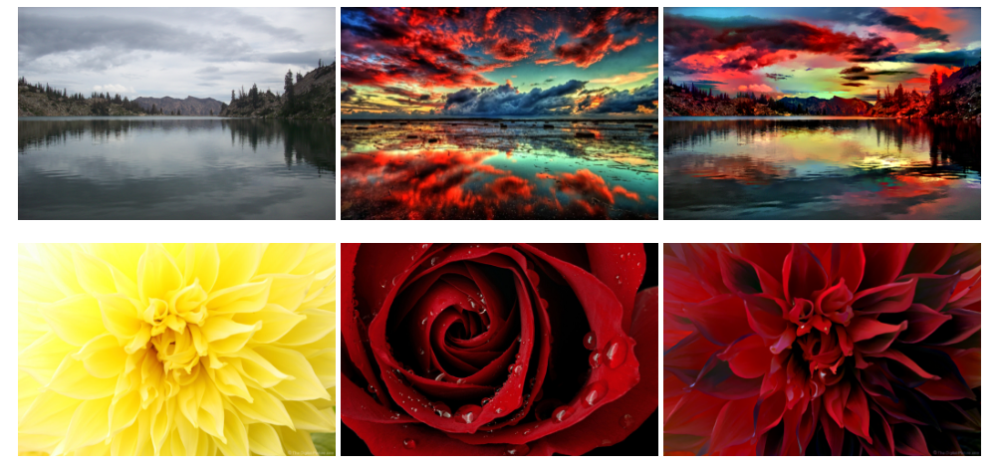
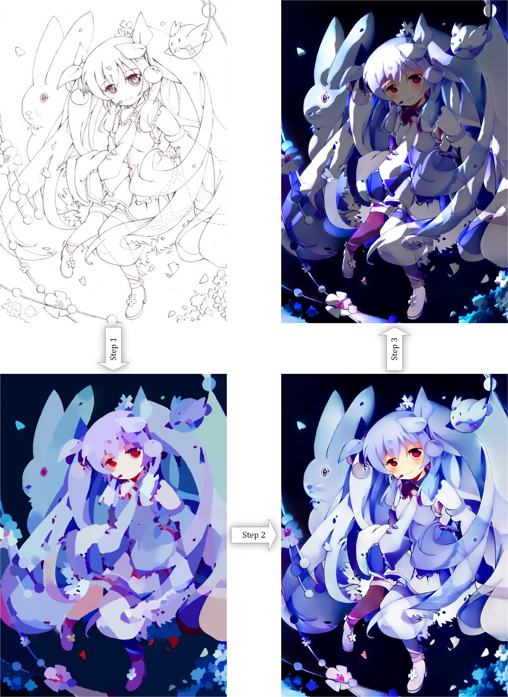
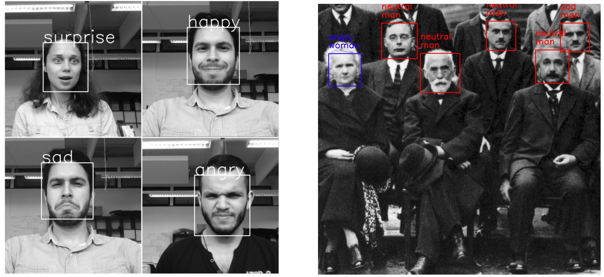
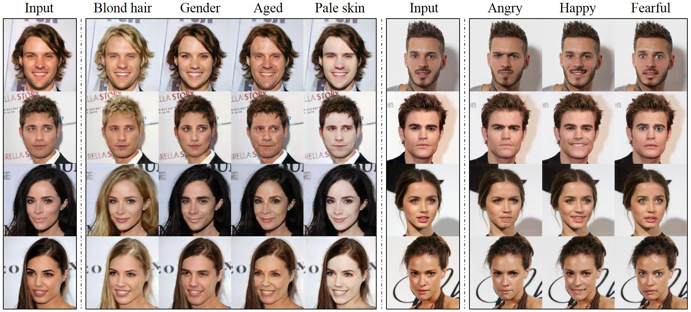
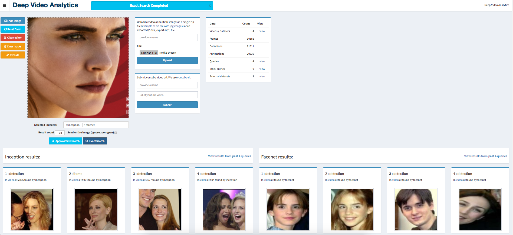
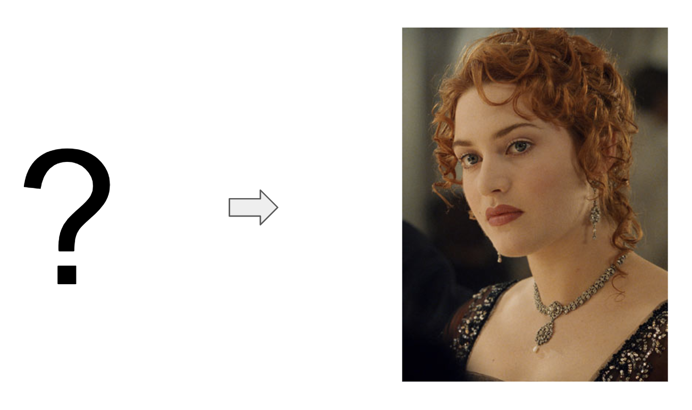
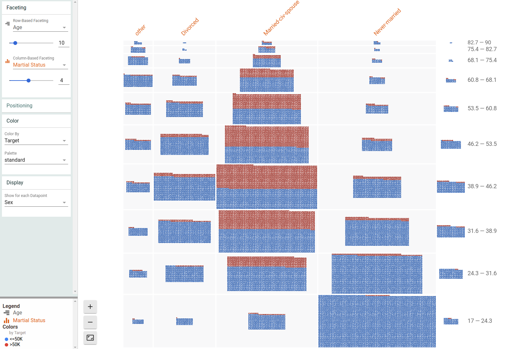

## Some interesting machine learning open source projects

### Open source

**FastText**

https://github.com/facebookresearch/fastText

> fastText is a library for efficient learning of word representations and sentence classification.

**Deep-photo-styletransfer**

https://github.com/luanfujun/deep-photo-styletransfer

> It can transform the original image into the specified style, and the generated image is very close to the real photo.

**Fast Style Transfer in TensorFlow**

https://github.com/lengstrom/fast-style-transfer

> The project is based on TesnorFlow, which can quickly transform the style of any image.

**Face_recognition**  

https://github.com/ageitgey/face_recognition

> "The simplest face recognition API in the world"

**Magenta**

https://github.com/tensorflow/magenta

> Magenta is a research project exploring the role of machine learning in the process of creating art and music. 

**Sonnet**

https://github.com/deepmind/sonnet

> Magenta is a research project exploring the role of machine learning in the process of creating art and music. 

**Style2Paints**

https://github.com/lllyasviel/style2paints

> Style2paints V4 is the current best AI driven lineart colorization tool.

**Image-to-image translation in PyTorch**

https://github.com/junyanz/pytorch-CycleGAN-and-pix2pix

> This project is Cycle GAN of PyTorch edition. CycleGAN uses confrontational generation network to realize image-to-image conversion.

**Fashion-mnist**

https://github.com/zalandoresearch/fashion-mnist

> Fashion-MNIST is a class MNIST data set. It contains not a picture of handwritten numbers, but a group of fashionable pictures.

**iGAN**

https://github.com/junyanz/iGAN

> IGAN can generate images of comparable photos in real time according to user's description. It can also be used as a visual debugging tool to help understand and debug depth generation models.

**Deep-image-prior**

https://github.com/DmitryUlyanov/deep-image-prior

> Deep convolution network is used to implement some common image inverse operations, such as denoising, improving resolution, image restoration, etc.

**Face_classification**

https://github.com/oarriaga/face_classification

> This is a real-time face detection model, and it can also classify faces and sexes.

**StarGAN**

https://github.com/yunjey/StarGAN

> StarGAN can flexibly translate an input image to any desired target domain using only a single generator and a discriminator. 

**Pix2pixHD**

https://github.com/NVIDIA/pix2pixHD

> Pytorch implementation of our method for high-resolution photorealistic image-to-image translation. 

**DeepVideoAnalytics**

https://github.com/AKSHAYUBHAT/DeepVideoAnalytics

> Deep Video Analytics is a platform for indexing and extracting information from videos and images. 

**deep-voice-conversion**

https://github.com/andabi/deep-voice-conversion

> Using deep neural network to change the style of voice

**AirSim**

https://github.com/Microsoft/AirSim

> AirSim is a simulator for drones, cars and more, built on Unreal Engine.

**Facets**

https://github.com/PAIR-code/facets

> The facets project contains two visualizations for understanding and analyzing machine learning datasets

### Thanks

The above pictures are from open source projects.

This is only a brief introduction to the project. You can see more about the project.

Thanks to all the open source project team and individuals for their hard work.

